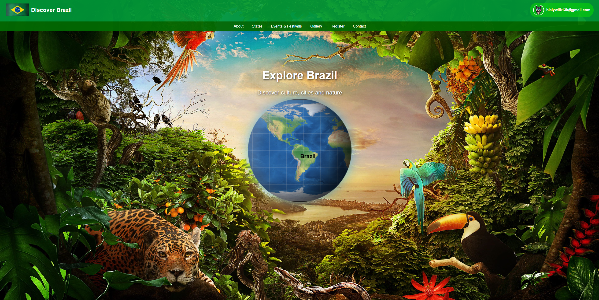
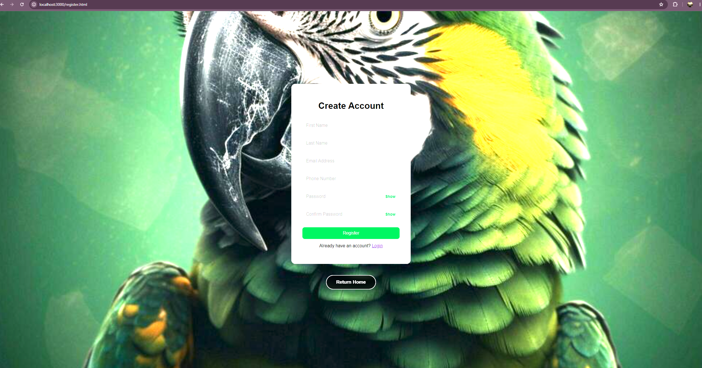
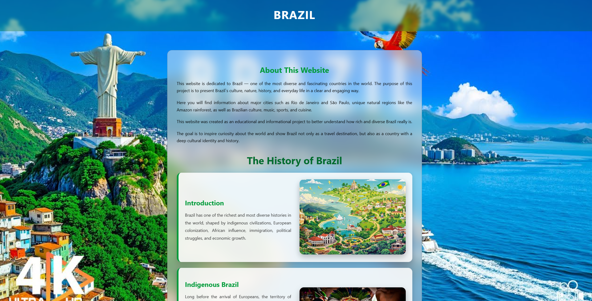
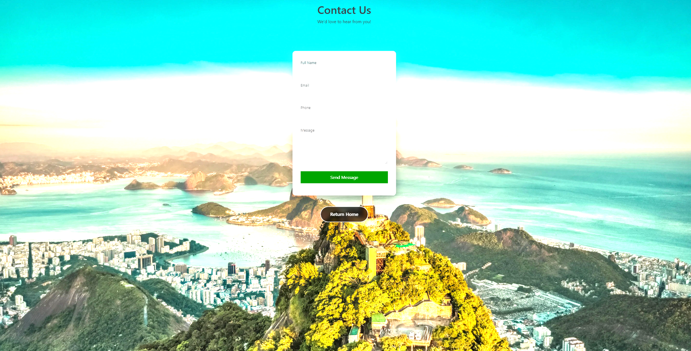

# Brazil Tourism Website

A full-stack website project about Brazil built with HTML, CSS, JavaScript, Node.js and Express.

## Project Preview

### Home Page

### Create Account

### About Brazil

### Contact Us

## Features
- User Registration & Login
- Avatar Upload System
- Gallery
- Responsive Design
- Brazil States Information
- Events Section
- Password Reset System

## Technologies Used
- HTML5
- CSS3
- JavaScript
- Node.js
- Express.js
- SQLite

## Live Demo
[brazill-website-production.up.railway.app](https://brazill-website-production.up.railway.app)

## Demo Video

 Watch the project demo:

https://youtu.be/5s_8MQK4ZIM

## Author
Krzysztof Kaminski
